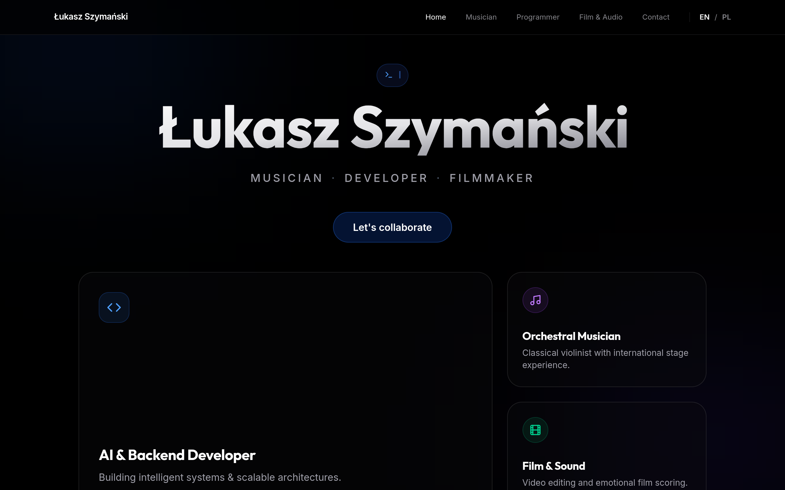

# Łukasz Szymański - Portfolio

  

A modern, high-performance personal portfolio built with **Astro** and **Tailwind CSS**. It showcases my professional work and achievements across multiple disciplines: Classical Musician, Software Developer, Filmmaker, and Film Composer.

## 🚀 Tech Stack

- **Framework:** [Astro](https://astro.build/)
- **Styling:** [Tailwind CSS](https://tailwindcss.com/)
- **Icons:** [Lucide Astro](https://lucide.dev/)
- **Deployment:** Netlify

## 🧞 Commands

All commands are run from the root of the project, from a terminal:

| Command                   | Action                                           |
| :------------------------ | :----------------------------------------------- |
| `npm install`             | Installs dependencies                            |
| `npm run dev`             | Starts local dev server at `localhost:4321`      |
| `npm run build`           | Build your production site to `./dist/`          |

## 📝 Changelog

  
<strong>2026-07-01</strong>

  
  - **Feature:** Added a new **Film Music** (`/film-music`) page to showcase original soundtracks, ambient scores, and custom cinematic compositions.
  - **Enhancement:** Added the "Film Music" link to both desktop and mobile navigation menus in `Layout.astro`.
  - **UX Improvement:** Replaced the strict `no-scroll` viewport locking (`hideScroll={true}`) with native vertical scrolling across all content-heavy pages (`Projects`, `Musician`, `Programmer`, `Filmmaker`). This greatly improves layout scalability and mobile user experience.
  - **Refactor:** Removed fixed-height constraints (`max-h-[75vh]`) and internal scrollbars (`overflow-y-auto`) from content columns.
  - **Feature (Issue #1):** Implemented complete **i18n and Polish language support**.
    - Extracted all English strings into `src/i18n/ui.ts` translation dictionaries.
    - Added a sleek **Language Switcher (EN / PL)** to the main navigation menu (desktop & mobile).
    - Configured Astro i18n routing (`prefixDefaultLocale: false`) with localized pages generated under `/pl/`.
    - Added **Smart Routing (Auto-Detection)**: users accessing the site from browsers with a Polish locale are automatically redirected to the Polish version on their first visit using client-side `localStorage` logic.
    - Added dynamic SEO metadata (`<link rel="alternate" hreflang="...">`) to `Layout.astro` for search engine indexing.
  - **Enhancement:** Temporarily removed the **CV/Resume** button from the main navigation (desktop & mobile).

## Recent Updates

- Optimized background video, added OpenGraph tags, and fixed external link security.
